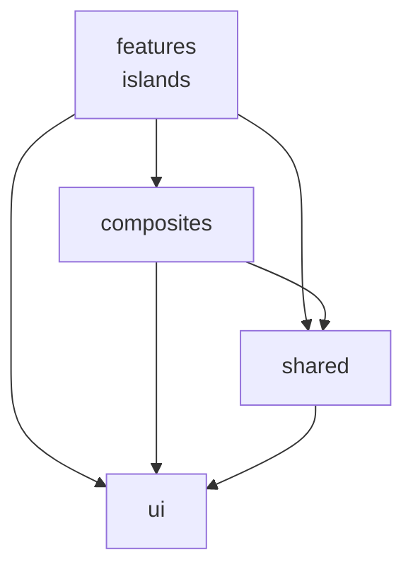

# React Islands

New interactive components are built as React islands. React code lives here in `app/javascript/react/`; the JSON API endpoints they talk to live in `app/routers/api/` (conventions: `app/routers/api/CLAUDE.md`). See `docs/react-migration.md` for the full strategy — the app is mid-migration from HTMX/Alpine, and both stacks coexist.

Key rules:

- HTMX does not touch React island DOM. No `hx-target` or `hx-select` pointing inside an island.
- React does not use `hx-*` attributes. Islands use `fetch()` for mutations.
- Load initial data from an `/api/` show endpoint, not via `data-props`. `data-props` is for bootstrap identifiers only (IDs, feature flags, CSRF) — if building the value required a query, it belongs in the endpoint. See `docs/react-migration.md` → "How Islands Get Data".

## Where new React code goes

Layering inside `app/javascript/react/` (one-way, enforced by `.dependency-cruiser.cjs` with zero exceptions). Arrows show allowed import direction:

Composites may also import each other freely.

- **`ui/`** — pure React components with no domain knowledge, no app state, no API calls. Imports nothing else in `react/`. Examples: Avatar, Dialog, Dropdown, Tooltip, BottomSheet, DateTime.
- **`composites/`** — domain-aware reusable UI, used across multiple feature islands. Built from `ui/` plus app knowledge. Flat widgets at the root (AvatarGroup, StatusDropdown, OwnerPicker, SubscriptionBell, etc.) plus feature sub-libraries (`chat/`, `editor/`, `markdown/`, `confirmationDialog/`, `MailboxActionBar/`). Composites may import each other freely.
- **`shared/`** — cross-cutting hooks, stores, and pure utilities (apiFetch, types, reactions, useChannelSubscription). Used by composites and features.
- **`features/`** — one directory per feature island (`documentEditor/`, `chatShow/`, `goalShow/`, etc.). Islands are sealed from each other and compose freely from `ui/`, `composites/`, and `shared/`.
- **`app/`** — the route tree and SPA shell, a sealed layer _above_ features: it may import `features/`, but nothing below may import it (enforced in `.dependency-cruiser.cjs`). Route definitions only — see `app/javascript/react/app/CLAUDE.md`.

Decision rule for new code: _does it have domain knowledge, app state, API calls, or channel subscriptions?_ If no → `ui/`. If yes and reusable across islands → `composites/`. If single-island → inside that island's directory under `features/`.

## Tests

**There are no test files in this tree** — they mirror it under `tests/javascript/react/`, so `composites/MailboxActionBar/snoozeSchedule.ts` is tested by `tests/javascript/react/composites/MailboxActionBar/snoozeSchedule.test.tsx`. Look there before concluding a component is untested, and write new tests there too, importing the subject through the `~/` alias — a co-located `*.test.tsx` fails lint. Run with `make test_javascript`.

## Read state

"Unread" / "last seen" behavior uses the shared `useWorkspaceVisitRecording(workspaceId)` hook (`shared/hooks/useVisitRecording.ts`), never a per-island read-state store. See the Visit tracking section in `CLAUDE.md`.

## Whitespace

`composites/markdown/Markdown.tsx` is a display renderer and is held to the whitespace-fidelity contract — authored space runs, single line breaks, and blank-line runs render byte-exactly. Don't regress it to collapse whitespace. See the whitespace section in `CLAUDE.md`.
