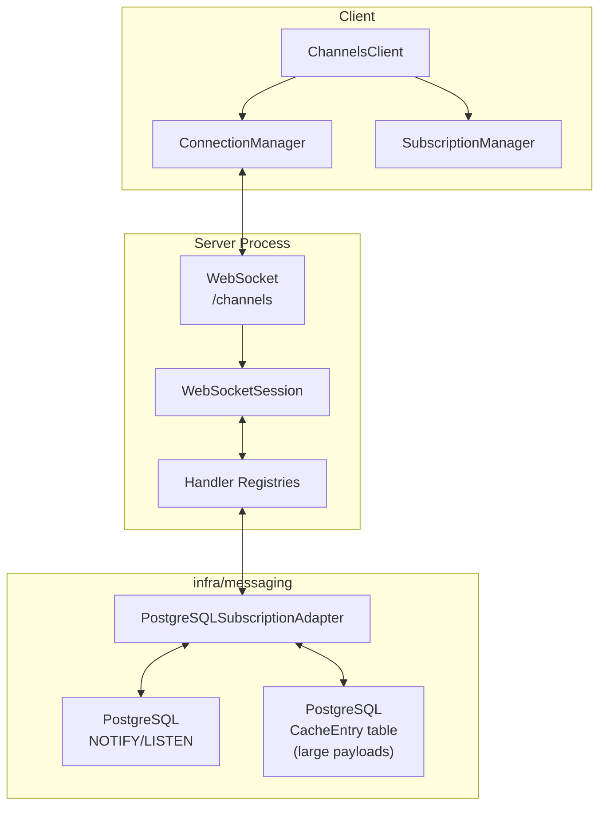
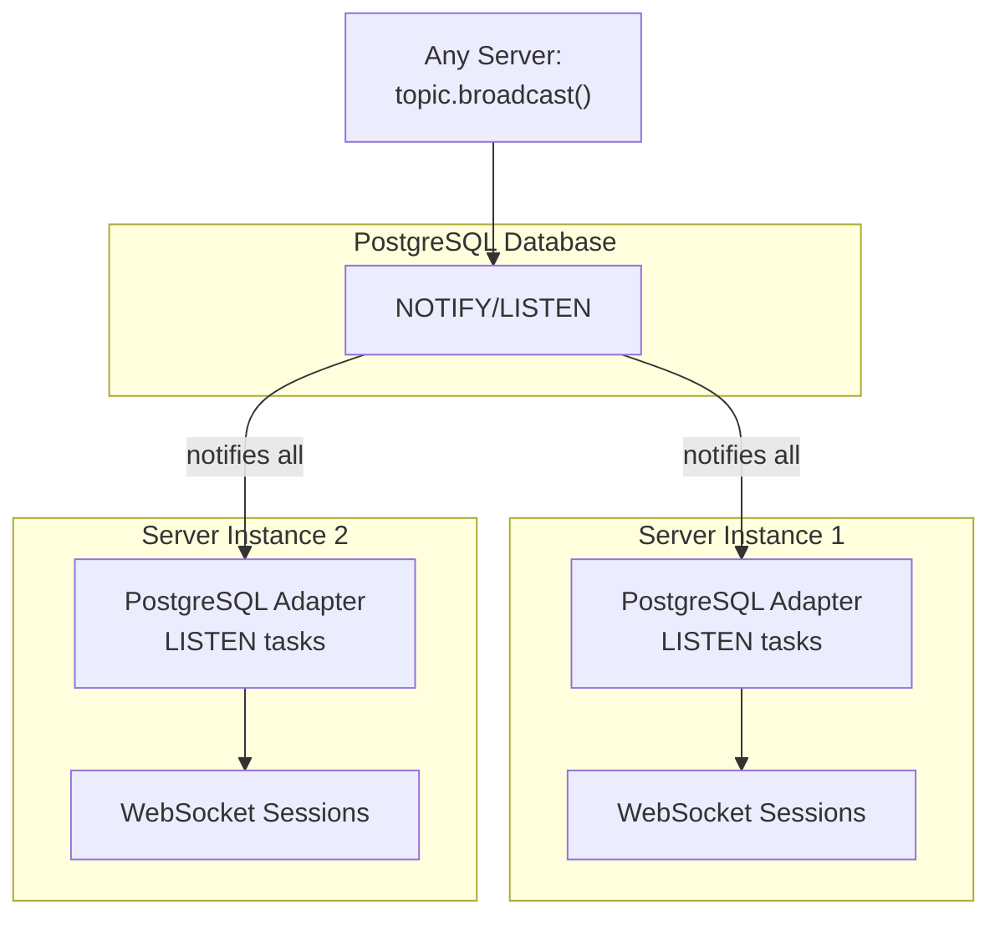
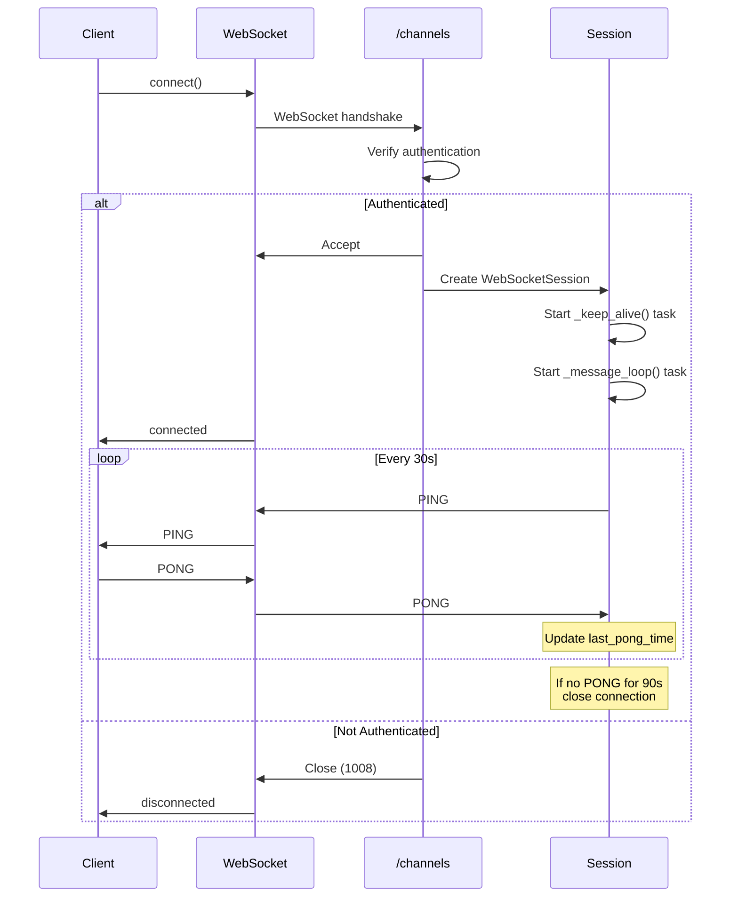
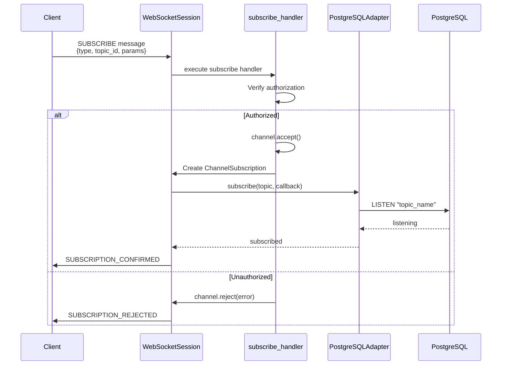
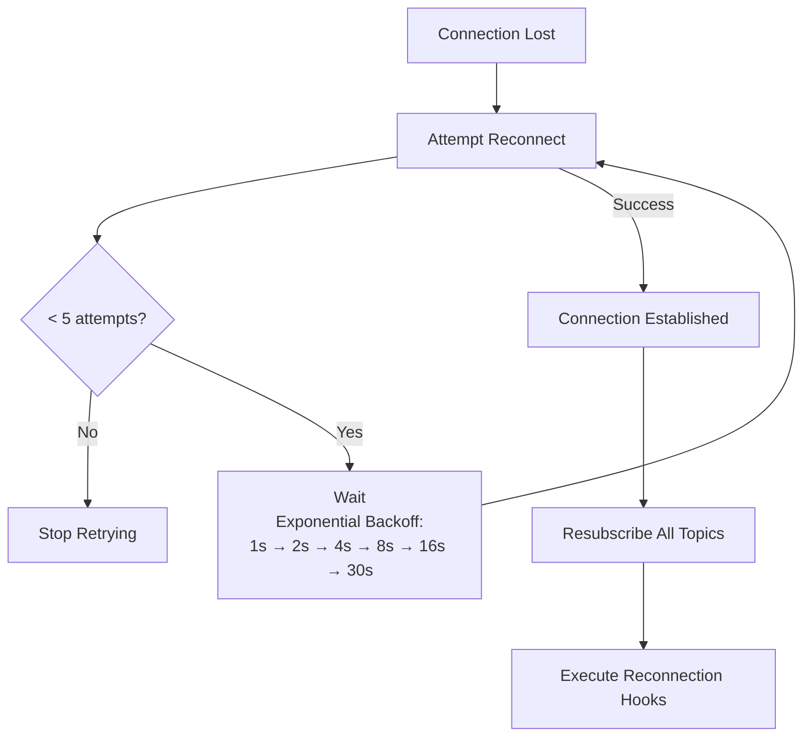
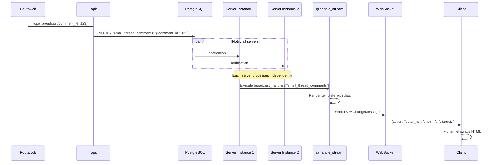
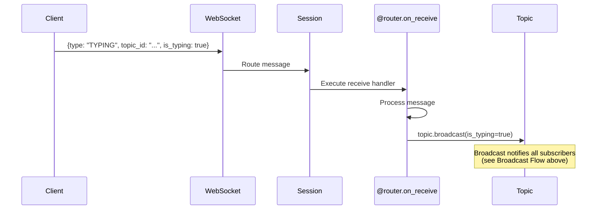

# Channels Infrastructure

Real-time bidirectional communication via WebSockets using PostgreSQL NOTIFY/LISTEN for pub/sub.

## Overview

Channels enable real-time updates between server and client. Topics identify channels with signed IDs for security. Server broadcasts to topics; subscribed clients receive updates automatically. Client JS manages connections; server Python handles subscriptions and broadcasts.

### Example End-to-End Flow

1. User updates comment → Route saves to DB
2. Route broadcasts: `await topic.broadcast(comment_id=id)`
3. PostgreSQL NOTIFY reaches all server instances
4. Each server calls `@handle_stream` for subscribed sessions
5. Handler renders HTML, sends via WebSocket
6. `hx-channel` elements swap HTML automatically

## Core Architecture



## Multi-Server Broadcasting



All server instances share PostgreSQL NOTIFY/LISTEN, enabling broadcasts to reach clients connected to any server.

## Connection Lifecycle



## Subscription Flow



## Client Reconnection Strategy



## Broadcast Flow



All servers receive every broadcast. Each server only sends to its own connected clients.

## Client Messages (on_receive)

Clients can send messages back to the server for bidirectional communication:



Use `@router.on_receive(stream, MessageClass)` in `app/channels/` to handle client messages. Common pattern: process message, then broadcast result to all subscribers.

## Writing Channel Handlers

Channel modules live in `app/channels/`, one per feature. Each defines a `ChannelRouter` with handlers, and must be registered in `app/main.py` via `channels.include_router(...)` — a created-but-unregistered router fails silently.

| Decorator | Purpose | Signature |
|-----------|---------|-----------|
| `@router.on_subscribe(stream)` | Handle subscription requests | `async def handler(channel: Channel)` |
| `@router.on_unsubscribe(stream)` | Handle unsubscription/cleanup | `async def handler(channel: Channel)` |
| `@router.on_receive(stream, MessageType)` | Handle client-sent messages | `async def handler(channel: Channel, message: MessageType)` |
| `@router.on_keepalive(stream)` | Handle periodic keep-alive pings | `async def handler(channel: Channel)` |

A complete bidirectional example is `app/channels/email_thread_comments.py` (typing indicators). A broadcast-only example is `app/channels/workspace_events.py`.

### Authorization

Every subscribe handler must check authorization before calling `channel.accept()`:

```python
@router.on_subscribe("workspace_events")
async def workspace_events_subscribe(channel: Channel):
    if await is_workspace_authorized(channel):
        await channel.accept()
    else:
        await channel.reject("Unauthorized access to workspace events.")
```

Shared helpers live in `app/channels/dependencies.py`: `is_workspace_authorized` (current user is a workspace collaborator), `is_current_user_authorized` (topic's `user_id` matches the session user), and `is_org_authorized`. For resource-specific checks, load the resource in the handler and reject if `collaboration.can_be_accessed_by(channel.current_user)` fails — see `app/channels/meetings.py`.

The only channels that may `accept()` unconditionally are genuinely public ones with no per-user data, like `version_refresh` in `app/channels/asset_reloading.py`.

### Trusted vs. untrusted parameters

`Channel` exposes two parameter sources, and the distinction is security-critical:

- **Topic params** are embedded in the signed topic ID generated server-side. Clients cannot tamper with them.
- **`channel.params`** is a free-form dict sent by the client. Never use it for authorization.

```python
# WRONG — params dict is client-controlled, any workspace_id can be sent
workspace_id = channel.params.get("workspace_id")

# RIGHT — get_param() checks signed topic params first
workspace_id = channel.get_param("workspace_id")
```

`channel.get_param(key)` prefers the signed topic params and only falls back to client params, so IDs used in authorization checks must come from the topic.

### Clean up state on unsubscribe

If a channel maintains shared state (typing indicators, presence), remove the user on unsubscribe — otherwise they linger after disconnecting:

```python
@router.on_unsubscribe("email_thread_comments")
async def email_thread_comments_unsubscribe(channel: Channel):
    email_thread_id = channel.get_param("email_thread_id")
    typing = Typing(scope_key=email_thread_scope_key(email_thread_id))
    typing_user_ids = await typing.remove_user(channel.current_user.id)
    await channel.topic.broadcast(typing_user_ids=typing_user_ids)
```

### Custom message types

Client-to-server messages are `ChannelMessage` subclasses. Add a value to `ChannelMessageType` in `config/enums.py`, then declare the class — the `_message_type` ClassVar registers it in the deserialization registry automatically:

```python
class MyCustomMessage(ChannelMessage):
    _message_type: ClassVar[ChannelMessageType] = ChannelMessageType.MY_CUSTOM_TYPE
    my_field: str
```

Message types shared by multiple channels (e.g. `TypingMessage`) live in `app/channels/dependencies.py`.

### Broadcasting from routers, jobs, and models

Any server code can broadcast by constructing a `Topic` with the same stream name and params the channel was subscribed with — params are part of the topic identity, so omitting one (e.g. `workspace_id`) silently broadcasts to a different topic nobody is listening on:

```python
from infra.messaging import Topic

topic = Topic("workspace_events", workspace_id=str(workspace.id))
await topic.broadcast(action="comment_added", comment_id=str(comment.id))
```

### Code references

- Channel/router base classes: `app/channels/base.py`
- Authorization helpers and shared messages: `app/channels/dependencies.py`
- Topic and pub/sub: `infra/messaging.py`
- WebSocket endpoint: `app/routers/channels.py`
- Router registration: `app/main.py`
- Client side: `app/javascript/channels/` (client, subscription manager, HTMX extension, Yjs provider)
