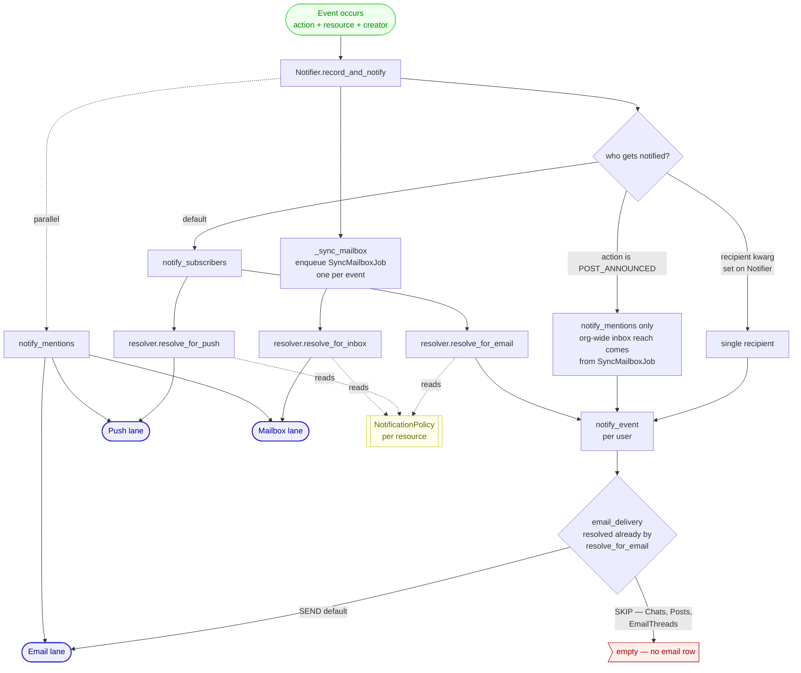
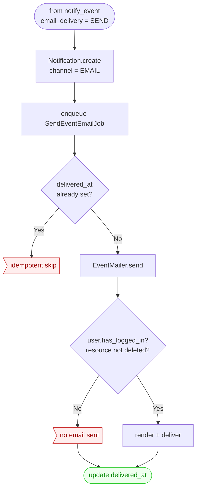
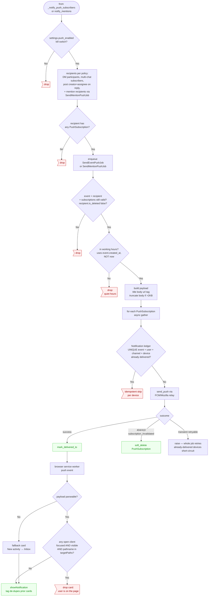
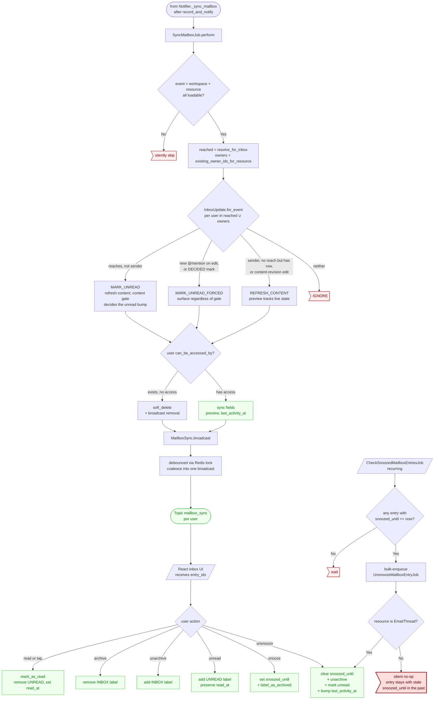

# Notifications flowchart

A trace of what happens when an event fires inside the app and how it (might) become a notification. The point isn't pretty docs — it's surfacing every gate and asymmetry so bugs have nowhere to hide.

Three channels are in play: **email**, **web push**, and the **mailbox** (in-app inbox). They share an entry point (`Notifier`) but diverge on almost every gate — working hours, kill-switches, `email_delivery` mode, mention type, presence in a focused tab.

**How to read this**: start with the overview to see how events route to the three channels, then drop into a specific lane when you care about its detail. Each lane has its own chart plus a list of asymmetries — places the code does something surprising. Cross-cutting asymmetries that don't belong to one lane live at the end.

Every event reaches its channels through one of four resolver methods — `resolve_for_inbox`, `resolve_for_push`, `resolve_for_email` (and the diagnostic `state_for`) — each composed atop the resource's `NotificationPolicy`. That consolidation is recent: the "[Where do product rules live?](#where-do-product-rules-live)" table below maps each settings-page promise to the single method that owns it. If you're hunting "the page promises X but the app does Y," start there.

Entry point: `app/jobs/notifications.py` (`Notifier`). Reach: `SubscriberResolver` + `NotificationPolicy` in `app/models/collaboration/workspace.py`. Push delivery: `app/jobs/push.py`. Email delivery: `app/mailers/notifications.py`. Mailbox state: `app/models/collaboration/mailbox.py`. Service worker: `static/service-worker.js`.

## Overview

Three channel methods, one shape: each asks "who does this event reach on this channel?" and answers by composing a subscription baseline with mention escalation and policy-driven force-includes. The dispatchers (notifier, mailbox job) are thin loops — they know nothing about mentions, DMs, broadcasts, or group mutes. Resource-specific behavior lives on `NotificationPolicy` (`force_include_for_inbox`/`_for_push`, `notify_subscriber_push`, `creator_and_assignee_reply_actions`, `broadcasts_to_organization`, `notification_group_id`, `muted_user_ids`, `notify_mention_push`), which each method reads polymorphically — no `isinstance(resource, Chat)` anywhere in the reach path.

The `SubscriberResolver` fallback chain — the baseline every method composes from — is its own piece of complexity. Per candidate, in order:

1. Explicit `Subscription` row for this workspace → use its `level`
2. User is the resource creator → `ALL`, even if global preference is `RELEVANT_ONLY`
3. User is a member of the resource's notification group (Posts only today) → **decisive**: `ALL` by default, `RELEVANT_ONLY` if a `PostGroupMute` row exists. Members never fall through to the global tier, so a per-group mute beats a global `ALL` preference and membership beats a global `RELEVANT_ONLY` preference.
4. Global `SubscriptionPreference` for the resource type → use its `default_level`. The new `BROADCASTS` level resolves to `ALL` only on **org-wide** resources (`notification_policy.broadcasts_to_organization` AND no `notification_policy.notification_group_id`) — i.e. posts addressed to the whole organization. On grouped or private resources, `BROADCASTS` reads as `RELEVANT_ONLY` for non-members.
5. Default → `RELEVANT_ONLY`

Only candidates resolving to `ALL` are returned; they must also pass `can_be_accessed_by`. The candidate set is workspace collaborators plus organization accessors **iff** `notification_policy.broadcasts_to_organization`. `PostNotificationPolicy.broadcasts_to_organization` is `True` whenever sharing is organization — including grouped posts. For grouped posts, non-members with global `ALL` still receive the post via the global-preference tier, but a member's mute (or membership default of `ALL`) is decided at tier 3 before global is consulted. Source: `SubscriberResolver` in `app/models/collaboration/workspace.py`.

Push notifies a narrower audience than this cascade. `resolve_for_push` notifies every subscriber (a member resolving to `ALL`) only for resources whose policy opts in via `notify_subscriber_push` — today just multi-person direct chats. Otherwise it fires per-policy: chat/post @mentions, DM messages, and replies on a post you created or are assigned. Raising a post or group-chat subscription to `ALL` never adds a push, and an org-wide announcement broadcast reaches the inbox without pushing. See the Push lane section for the full trigger set. `SubscriptionSource` and `_source_for` are diagnostic-only, powering `state_for` for the per-user subscription-state UI.

## Where do product rules live?

Every sentence on the `/notifications` settings page is a reach rule, and each one now lives in exactly one place. This is the table to consult when a bug report says "the page promises X but the app does Y" — the fix should be a one-method change at the listed home, not a three-file patch across resolver, notifier, and sync job. If a fix touches more than one row's home, the consolidation has regressed.

| Settings page promise | Owned by | How |
|---|---|---|
| **All / Relevant to me** (per resource type) | `SubscriberResolver._level_for` | Subscription → creator → group membership → global-pref cascade; only `ALL` is reached. Feeds every channel method's baseline. |
| **Everyone and my groups** (Posts `BROADCASTS`) | `SubscriberResolver._level_for` + `PostNotificationPolicy.broadcasts_to_organization` | `BROADCASTS` resolves to `ALL` only on org-wide posts (policy says broadcasts + no group); otherwise `RELEVANT_ONLY`. |
| **Per-group mute** (Posts) | `PostNotificationPolicy.muted_user_ids` | Resolver's membership tier reads it; a muted member resolves to `RELEVANT_ONLY` even over a global `ALL`. |
| **@mentions always reach you** — inbox | `SubscriberResolver.resolve_for_inbox` | `direct_recipients` (@mention recipients plus an assignment's assignee) are force-included on top of the baseline. |
| **@mentions always reach you** — push | `Notifier.notify_mentions` + `notify_mention_push` | Mentions get a dedicated `SendMentionPushJob`; `notify_mention_push` gates whether the resource type pushes (chat and posts today). Excluded from `resolve_for_push` to avoid a double-fire. |
| **Direct asks always reach you** (DMs) — inbox | `SubscriberResolver.resolve_for_inbox` + `ChatNotificationPolicy.force_include_for_inbox` | DM policy force-includes every collaborator; they have no `Subscription` rows so the baseline alone wouldn't reach them. |
| **Direct asks always reach you** (DMs) — push | `SubscriberResolver.resolve_for_push` + `ChatNotificationPolicy.force_include_all_collaborators_for_push` | Read inside `resolve_for_push`; no inline DM block in the dispatcher. Multi-person direct chats push via `notify_subscriber_push` instead (subscribers, so muting silences). |
| **Email vs in-app** (which channels fire) | `WorkspaceMixin.email_delivery` (`resolve_for_email` returns empty for `SKIP`) | `SKIP` resources (Chat, Post, EmailThread) surface via inbox + push only; no `Notification` row is written. |
| **Push working hours / device on-off** | `User.is_in_working_hours` + `settings.push_enabled` | Channel-specific delivery filters composed *after* reach, in the Push lane — not reach rules, so not on the resolver. |

Row continuity ("a mentioned-then-quiet chat keeps tracking live content") is deliberately **not** on this list: it isn't a settings-page promise but a mailbox-UX behavior, owned by `InboxUpdate.for_event` + `MailboxEntry.existing_owner_ids_for_resource` at the mailbox boundary (the resolver can't import `MailboxEntry`). See the Mailbox lane.

## Email lane

### `email_delivery.SKIP` is a three-way fork.

Resources override `WorkspaceMixin.email_delivery`:
- Most resources: `SEND` → write a `Notification` row, enqueue a `SendEventEmailJob`, send the email.
- Chats, Posts, EmailThreads: `SKIP` → no `Notification` row, no email. The mailbox is synced via a single `SyncMailboxJob` per event, enqueued by `Notifier._sync_mailbox` — separate from the per-recipient email/push fan-out.
- **Push runs regardless of `email_delivery`** — there's no SKIP path for push (`app/jobs/notifications.py:128-132`).

So a chat message: no email row ever exists, but mailbox + push both fire. Searching for a "missing email notification" on a chat will find nothing because nothing was ever written.

### Every `SEND` event emails immediately.

`notify_event` writes the `Notification` row and enqueues a `SendEventEmailJob` in the same step (`app/jobs/notifications.py:126-129`). There's no deferral tier: the job renders via `EventMailer.send` and marks `delivered_at` once, guarding re-runs on the `delivered_at`-already-set check. A row sitting at `delivered_at = null` for long means the `SendEventEmailJob` is stuck (queue back-pressure, retry backoff, worker outage), not that anything is waiting on a timer.

## Push lane

### Push has a working-hours window. Email and mailbox don't.

`User.is_in_working_hours()` (`app/models/accounts.py:523`) only gates push jobs. A user with 09:00–17:00 set who's mentioned at 11pm gets no push card, still gets the email immediately, and still gets the mailbox entry instantly. The asymmetry is intentional ("don't interrupt me"), but it's worth knowing that "I muted notifications" is not how the system reads it.

### Working-hours edge cases that look like bugs but aren't (and one that might be).

- **Cross-midnight windows** (e.g. `22:00–06:00`): logic is `local >= start OR local < end`. Easy to misread as "always deliver."
- **`start == end`** is silently treated as **"never push"**, not "always push" (`app/models/accounts.py:537`). If a UI bug ever lets a user pick the same value, push goes to a black hole with no error.
- **`when` is the event timestamp, not `now()`** (`app/models/accounts.py:525`). A job queued at 18:59 that runs at 19:01 still delivers. Reasonable, but means changing working hours doesn't retroactively suppress in-flight jobs.

### Mentions push for chats and posts. Docs, goals, meetings — no push.

`notify_mentions` gates the mention-push branch on `self.resource.notification_policy.notify_mention_push` (`app/jobs/notifications.py`). Chat and Post policies return `True`; the base policy (goals, docs, meetings) returns `False`. An @-mention on a goal/doc/meeting still reaches the user's inbox and email, but their lock screen stays quiet — those resources are async, not interrupt-worthy. The mention-push job (`SendMentionPushJob`) resolves its resource generically, so the same payload path serves both chat and post mentions. To make a new resource type push on mention, override `notify_mention_push` on its policy — one place, no `isinstance` edit.

### Push notifies a narrower audience than the subscription cascade.

`SubscriberResolver.resolve_for_push` does **not** notify every effective subscriber the way inbox/email do. Each resource's policy opts into a specific push audience. Combined with the `notify_mentions` path, the complete push trigger set is:

1. **Chat @mention** → push, via `notify_mentions` + `notify_mention_push`. An @mention names you specifically.
2. **DM message** → push every participant, via `force_include_all_collaborators_for_push` (regardless of subscription level — a DM has no @mention and is rarely muted).
3. **Multi-person direct-chat message** (3+ people, no group) → push every effective subscriber (members at level `ALL`, the default), via `notify_subscriber_push`. Muting the chat drops you below `ALL` and silences it. A multi-person direct chat is a DM with more people.
4. **Post @mention** → push, via the same `notify_mention_push` path now that the Post policy opts in. This holds even when the post is an announcement — an @mention names you regardless of the surrounding post type.
5. **Reply/comment on a post you created or are assigned** (`POST_COMMENTED`) → push the post's **creator and assignee**, via `notification_policy.creator_and_assignee_reply_actions`.

Everything else gets **no push**, regardless of subscription level:

- **Published post** (`POST_CREATED`), org-wide or grouped, at any level including `ALL`.
- **Announcement broadcast** (`POST_ANNOUNCED`) — reaches the whole org's inbox via the `SyncMailboxJob` → `resolve_for_inbox` force-include over org accessors, but never pushes (posts are `EmailDelivery.SKIP`, so no email either). Posts don't move at chat pace, so an org-wide blast shouldn't buzz everyone's device. (An @mention *inside* an announcement still pushes — that's trigger 4, the `notify_mentions` path.)
- **Group-backed (channel) chat message** at any level including `ALL` — a channel message reaches the inbox but doesn't push.
- **Any goal / document / meeting event**, including @mentions on them.

The working-hours window and the `push_enabled` kill switch still gate every push above (enforced in `SendEventPushJob` / `SendMentionPushJob`).

This narrows a prior model where any `ALL` subscriber (a global `ALL`, `BROADCASTS` on org-wide posts, or group membership) was pushed for ordinary post/chat activity — which made the three Post levels feel indistinguishable on the lock screen. The subscription level now drives inbox/email; push is per-policy. An explicit per-resource subscription no longer pushes you for all of a post thread's activity — a recipient-controlled "push everything here" toggle is deferred (B2).

### Direct chats force-include within the resolver — DMs always, multi-person unless muted.

`resolve_for_push` push-notifies every participant of a 1:1 **DM** via `force_include_all_collaborators_for_push`, regardless of subscription level; the parallel `force_include_for_inbox` lands the DM in each participant's inbox (`resolve_for_inbox`), so push and inbox stay consistent for DMs. DM participants have no `Subscription` rows by construction, so the baseline cascade alone wouldn't reach them. A **multi-person direct chat** instead opts in via `notify_subscriber_push`, which pushes its effective subscribers (members at `ALL`) — so muting it silences push without the force-include override. This all lives inside the resolver methods (via the policy), not as an inline block in `_notify_push_subscribers` — the dispatcher no longer knows what a DM is.

But the **email path doesn't force-include**: chats are `email_delivery.SKIP`, so `resolve_for_email` returns empty for them regardless. A DM participant gets push and an inbox row but, with the default `RELEVANT_ONLY` chat preference, no email. Whether that's a feature ("DMs are realtime, email would be noise") or a gap depends on who you ask.

### Push idempotency is per-device, by unique constraint.

`Notification.push_record_for` uses `get_or_create` against a unique `(event_id, user_id, channel, device_id)` index (`app/models/collaboration/workspace.py:526`). On retry, devices that already have `delivered_at` set short-circuit, so a retry that succeeded for 3 of 5 devices won't re-send to the 3. The "raise to retry whole job" pattern only re-runs failed devices.

### Service worker focus-suppression has gotchas worth knowing.

Focus check at `static/service-worker.js:70`:
- Requires **both** `focused` **and** `visibilityState === "visible"`. Sounds redundant, but `focused` can be `true` for a window on a different monitor that's covered by another window — `visibilityState` catches that.
- The target-paths set is built from **payload fields only**, not the fallback `/inbox`. Otherwise a malformed payload while the user is on `/inbox` would silently drop the fallback card, violating Chrome's `userVisibleOnly` contract.

### Push subscription rotation is fire-and-forget.

`pushsubscriptionchange` re-subscribes and POSTs to `/api/push/subscriptions` (`static/service-worker.js:164`). If the re-subscribe succeeds but the POST fails (network drop, server error), there's currently no in-app surface telling the user they've effectively lost push until they manually re-enable. Comment at line 206 marks this as v2.

## Mailbox lane

There is **one** mailbox engine for all resource types (chat, post, email thread): a single concrete `BaseMailboxEntry.sync` with two paths. The **event path** (Notifier-mediated) handles everything that flows through `record_and_notify` — new messages, comments, comment edits/deletes, decisions. The **content (no-event) path** handles the one mutation that isn't a workspace `Event`: inbound email (`EmailThread.on_publish` → `Mailbox.sync(thread)`). That `on_publish` sync is the **only** remaining non-Notifier writer; both paths share the same reach resolution and content layer.

`SyncMailboxJob` is the single writer for the event path: one job per event. It doesn't iterate every collaborator — it unions the event's **reach** (`resolve_for_inbox`: ALL-level + @mention + DM/email force-include) with everyone who **already has a row** (`MailboxEntry.existing_owner_ids_for_resource`), then runs the per-person `InboxUpdate.for_event` cascade.

The cascade is the Slack content model: an existing row tracks the resource's latest content even for a RELEVANT_ONLY user — mute/archive/snooze gate *unread + inbox presence*, not the preview. `InboxUpdate.for_event` is the single decision site (documented as a truth table at `app/models/collaboration/mailbox.py`), returning one of four outcomes per person:

- **MARK_UNREAD** — the event reaches you and you didn't send it; the resource's content gate decides whether it actually bumps unread (e.g. a chat edit refreshes content without re-alerting).
- **MARK_UNREAD_FORCED** — surface regardless of the content gate: an edit's newly-added @mention, or a `DECIDED` mark the content gate can't see.
- **REFRESH_CONTENT** — you sent the reaching event, *or* you have an existing row but the event doesn't reach you (your row stays current without re-alerting). `CONTENT_REVISION_ACTIONS` (comment edits/deletes) land here for everyone except a newly-@mentioned user.
- **IGNORE** — the event neither reaches you nor finds an existing row.

### The mailbox real-time broadcast has a coalescing window with a known edge case.

`MailboxSync._debounced_broadcast` (`app/models/collaboration/mailbox.py:224-291`) gathers entry IDs into a Redis set and fires one broadcast per `mailbox_sync_debounce_seconds`. It explicitly handles two races (TOCTOU on lock acquisition, leftover entries after `set_read`). Worth understanding before changing the debounce constant: the dropouts the cycle handles are real, not paranoia.

### 🐛 The auto-unsnooze cron is `EmailThread`-only despite snooze being available for all resources.

`Mailbox.snooze` works for any registered mailbox-entry type — Post, Chat, EmailThread, Goal, etc. (`app/models/collaboration/mailbox.py:587-591`). `CheckSnoozedMailboxEntriesJob` (`integrations/google/jobs/gmail.py:684`) is a recurring cron that scans all `MailboxEntry`s with `snoozed_until <= now` and enqueues `UnsnoozeMailboxEntryJob` for each.

But `UnsnoozeMailboxEntryJob.perform` (`integrations/google/jobs/gmail.py:664-665`) bails on non-`EmailThread` resources: `if not email_thread or not isinstance(email_thread, EmailThread): return`. So for a snoozed Post or Chat:
- the cron picks the entry up
- the job runs but immediately returns
- `snoozed_until` is **never cleared**, the entry is **never unarchived**, `label_as_unread` **never fires**
- `MailboxEntry.is_snoozed_now` evaluates `snoozed_until > now` (`mailbox.py:139-145`), so the entry shows as "not snoozed anymore" to the UI — but the underlying field is still set, and the entry stays archived

Net effect: snoozed non-Email entries appear to unsnooze at the expiry time (UI-wise) but stay archived and read forever. The cron's location (under `integrations/google/`) is a clue that this was designed for Gmail-imported threads and never generalized.

## Cross-cutting asymmetries

These don't belong to a single lane — they shape who gets notified before any channel-specific gates apply.

### The "creator gets ALL by default" rule beats global RELEVANT_ONLY — but only for inbox.

`SubscriberResolver._level_for` (`app/models/collaboration/workspace.py:1067-1086`) checks the explicit Subscription row first, **then** the creator rule, **then** group membership, **then** the global preference. If you start a post and have global posts preference `RELEVANT_ONLY`, you still get notified about replies in the inbox — being the author beats the preference. Only an explicit per-resource RELEVANT_ONLY (i.e., muting your own post) takes you out. Muting a group you posted to also doesn't drop you, since the creator rule sits above the membership tier.

The push lane does not apply this creator-to-`ALL` rule — being the author alone never triggers a push. A reply on a post you created does push you, but via a separate path: `creator_and_assignee_reply_actions` reaches the post's creator and assignee on `POST_COMMENTED`, independent of subscription level — on both push and inbox (force-surfacing the inbox row past the content gate, which re-opens a thread the owner archived). See the Push lane section for the full trigger set.

### Group membership is decisive for inbox: members don't fall through to global.

The membership tier short-circuits the cascade for any user who is a member of the post's notification group. A muted member resolves to `RELEVANT_ONLY` regardless of what their global preference says — so a global `ALL` preference can't override a per-group mute. Conversely, an un-muted member resolves to `ALL` even if their global preference is `RELEVANT_ONLY` (the new default after the `BROADCASTS` migration) — so joining a group is the explicit opt-in to its post traffic.

Non-members (no group membership row) skip the membership tier entirely and consult the global preference. This is where `BROADCASTS` matters: a non-member with `BROADCASTS` global pref gets `ALL` on org-wide posts (no group), `RELEVANT_ONLY` on grouped posts they aren't in. Members never reach this branch — their level is decided one tier earlier.

### The sender exclusion is keyed off `current_user`, not `creator_id`.

`record_and_notify` lets the caller override `creator_id`, but `exclude_user_id` is always `self.current_user.id` (`app/jobs/notifications.py:64`). If a code path attributes an event to user X but the request is on user Y's behalf, **Y** is excluded from notifications, not X. Author-on-behalf-of-bot flows can therefore notify the actual author (a feature) — but a misuse where `creator_id` is overridden to "system" will still suppress the active user (probably surprising).

### POST_ANNOUNCED has stricter membership gates than normal fanout.

An announcement's org-wide reach is inbox-only: `resolve_for_inbox` force-includes org accessors for the `POST_ANNOUNCED` event, gating out `is_deleted` and never-`last_logged_in_at` accounts (`app/models/collaboration/workspace.py`, the force-include branch). So a never-logged-in invited member is **not** force-included into an announcement's inbox — though, like any org-wide post, they can still be reached by the ALL-tier path if their effective Post level resolves to `ALL`. The exclusion applies to the force-include (below-ALL) population only.

### `mention.event_id` is nullable — orphaned mentions exist.

The FK is `ON DELETE SET NULL` (`app/models/collaboration/workspace.py:1119`). If the event is deleted before the mention is processed, the mention is orphaned. Both the push job (`app/jobs/push.py:43`) and the mailbox-sync mention branch (`app/jobs/notifications.py:177`) guard against this and drop the mention. The **email** mention path (`SendMentionJob`) does **not** check `event_id` — but the mention email doesn't need the event, only the mention itself, so this is fine in practice.

## Model glossary

| Model | Role | File |
|---|---|---|
| `Event` | What happened — action + resource + creator | `app/models/collaboration/workspace.py:475` |
| `Notification` | Per-event-per-user-per-device delivery ledger (EMAIL or PUSH channel) | `app/models/collaboration/workspace.py:499` |
| `Mention` | An @-mention extracted from event content | `app/models/collaboration/workspace.py:1111` |
| `Subscription` | Per-workspace explicit subscription override | `app/models/collaboration/workspace.py:755` |
| `SubscriptionPreference` | Per-user per-resource-type default. Post supports a third `BROADCASTS` level that resolves to `ALL` only on org-wide posts. | `app/models/collaboration/workspace.py:785` |
| `PostGroupMute` | Existence row: silences post notifications for a (user, group) pair. The resolver consults it via `PostNotificationPolicy.muted_user_ids`. | `app/models/workspaces/posts.py:240` |
| `PushSubscription` | Browser device registration (endpoint + VAPID keys) | `app/models/accounts.py:682` |
| `MailboxEntry` | In-app inbox row per resource per user | `app/models/collaboration/mailbox.py:66` |

## Job glossary

| Job | Queue | Purpose | File |
|---|---|---|---|
| `SendEventEmailJob` | EMAIL | Send a single event email | `app/jobs/notifications.py:185` |
| `SendMentionJob` | EMAIL | Send a mention email | `app/jobs/notifications.py:201` |
| `SyncMailboxJob` | UI | Recompute every collaborator's `MailboxEntry` for a recorded event's resource | `app/jobs/mailbox.py` |
| `SendEventPushJob` | PUSH | Send a per-event push to all of a user's devices | `app/jobs/push.py:100` |
| `SendMentionPushJob` | PUSH | Send a per-mention push to all of a user's devices | `app/jobs/push.py:29` |
| `CleanupPushSubscriptionsJob` | recurring | Hard-delete soft-deleted devices >30 days old | `app/jobs/cleanup_push_subscriptions.py` |
| `CheckSnoozedMailboxEntriesJob` | MISCELLANEOUS, recurring | Sweep entries past `snoozed_until` and enqueue per-entry unsnooze | `integrations/google/jobs/gmail.py:684` |
| `UnsnoozeMailboxEntryJob` | MISCELLANEOUS | Auto-unsnooze a single entry — **EmailThread-only**, no-ops for other resources | `integrations/google/jobs/gmail.py:652` |
