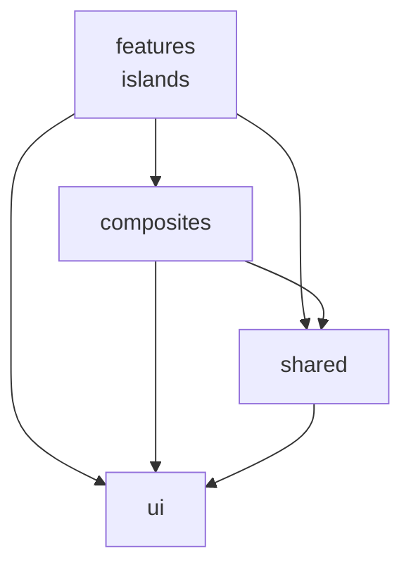

# React Migration

This document describes our strategy for incrementally migrating the frontend from HTMX/Alpine.js to React using an islands architecture.

The migration is driven by two things. First, complex interactive UI (collaborative editors, real-time features, stateful components) is fighting Alpine's model — leading to fragile DOM manipulation, race conditions, and edge cases that are hard to fix. Second, Claude Code is significantly more capable with React than with HTMX/Alpine. Since Claude Code does the majority of frontend implementation, aligning on React means we ship features faster and at higher quality.

The approach is gradual — React islands coexist with HTMX pages during the transition — but the end state is a fully React frontend with Alpine and HTMX removed.

---

## Prior Art

This migration follows the [islands architecture](https://jasonformat.com/islands-architecture/) pattern documented by Jason Miller (Preact), building on work by Katie Sylor-Miller (Etsy). The idea: interactive components hydrate independently on an otherwise server-rendered page.

References:
- [Islands Architecture](https://jasonformat.com/islands-architecture/) — Jason Miller's foundational post
- [Islands Architecture (patterns.dev)](https://www.patterns.dev/vanilla/islands-architecture/) — Deep-dive with diagrams
- [Astro Islands](https://docs.astro.build/en/concepts/islands/) — Production implementation of the pattern
- [Sharing State Between Islands (Astro)](https://docs.astro.build/en/recipes/sharing-state-islands/) — Cross-island state patterns

---

## Principles

These guide every decision during the migration.

1. **Net new interactive UI is React.** After the initial POC cycle, new components with non-trivial interactivity should be built in React. Simple forms and CRUD pages that work fine in HTMX can stay or be built in HTMX — use the decision guide below. Examples of "use React": a drag-and-drop board, a multi-step wizard with client-side validation, anything with real-time collaboration or optimistic updates. Examples of "HTMX is fine": a settings page with form fields, a list page with filters and pagination, a simple confirmation modal.

2. **Migrate by complexity, then everything else.** Prioritize components where Alpine is actively causing problems. Working HTMX pages get migrated too — just not first. The end state is no Alpine/HTMX. Current hot spots:
   - **Document editor comments** (`draftComments.ts`, 757 lines) — manual DOM positioning, HTMX swap survival, mark restoration, double-rAF hacks to beat Alpine's async reactivity
   - **Rich text editor** (`editor.ts`, `liveDocuments.ts`) — Alpine wrappers around ProseMirror/Yjs that fight the framework boundary
   - **Email threads** — complex real-time updates, scroll management, reconnection handling across Alpine + channels
   - **Command palette** — stateful search with keyboard navigation, fuzzy matching

3. **API grows just-in-time.** JSON endpoints in `/api/` are added as components migrate. No speculative API work. The API follows FastAPI conventions with consistent patterns (see API section).

4. **Shared UI components are replaced atomically.** When a Jinja+Alpine component (dropdown, date picker, modal) gets a React equivalent, the React version is a self-contained component. Both versions coexist until all consumers migrate, then the Jinja version is removed.

5. **The migration should be invisible to users.** No feature regressions during migration. Each migrated component should work at least as well as before, ideally better.

6. **Shared UI components stay in sync.** When a visual or behavioral change is made to a component that exists in both Jinja and React (dropdown, modal, date picker, etc.), the change must be applied to both versions. This prevents silent divergence during the coexistence period.

7. **The team ramps up together.** Engineers new to React will ramp up through pairing on early islands and working with Claude Code. The Phase 1 POC is also the team's learning vehicle — expect velocity to be lower initially.

---

## Architecture

### Islands Model

A React island is a self-contained React app mounted into a server-rendered page. The server (FastAPI + Jinja) still owns the page — layout, navigation, authentication, and simple UI remain server-rendered. React takes over specific regions of the page where interactivity demands it.

```
┌─────────────────────────────────────┐
│ Server-rendered (Jinja + HTMX)      │
│ ┌─────────────────────────────────┐ │
│ │ React Island A                  │ │
│ │ (own state, own lifecycle)      │ │
│ └─────────────────────────────────┘ │
│                                     │
│ More server-rendered content        │
│ ┌──────────┐  ┌──────────────────┐  │
│ │ Island B │  │ Island C         │  │
│ └──────────┘  └──────────────────┘  │
└─────────────────────────────────────┘
```

### How Islands Get Data

Islands fetch their own data from `/api/` on mount. The HTML router passes **only the identifiers** needed to make that first call — typically a resource ID, the current user ID, or a feature flag. Anything that would require a database query to build belongs in an API endpoint, not in `data-props`.

```html
<!-- Jinja template: identifiers only, no loaded rows -->
<div id="react-document-editor"
     data-props='{"documentId": "{{ document.id }}"}'></div>
```

```typescript
// React entry point reads identifiers, then fetches the real data.
const el = document.getElementById('react-document-editor')
const props = JSON.parse(el!.dataset.props!)
createRoot(el!).render(<DocumentEditor {...props} />)

// Inside DocumentEditor:
const { data } = useFetch(`/api/documents/${documentId}`)
```

**Why endpoint-first, not `data-props`-first.** Serializing loaded data into `data-props` turns the HTML router into a de facto API — but one that's untyped, single-use, and invisible to any other caller. The moment a second consumer needs the same data (a sibling island, a client-side refetch after mutation, a channel-driven update), there's no endpoint to reuse and the work has to be duplicated. The HTML router ends up maintaining a sprawling props blob that mirrors what a proper show endpoint would return anyway.

If you're about to add a field to `data-props` that required a `.select_related()` or a serializer call, stop and build the `/api/` show endpoint instead. The HTML router's job is to render the shell and hand off identifiers.

**What `data-props` is for.** Only values that are either already on the page for free or cannot be discovered by the client:

- Resource identifiers needed to make the first API call (document ID, meeting ID).
- The current user ID when it's the only thing needed to bootstrap.
- Server-controlled config React can't discover on its own (feature flags, experiment variants).
- CSRF token if not already exposed via the existing `<meta>` tag.

**Mutations** go through the same `/api/` endpoints. See the API section.

### How Islands Communicate

Multiple React islands on the same page share **UI/client state** through a [Zustand](https://zustand.docs.pmnd.rs/) store. Since Zustand stores are plain JS modules, any island that imports the store subscribes to updates — no shared React tree needed. See [createStore (vanilla)](https://zustand.docs.pmnd.rs/apis/create-store) for the non-React API. (Shared *server* state — fetched resources kept live by channels — lives in the TanStack Query cache instead; see the Client-Side Router ADR's data-loading conventions.)

```typescript
// shared/stores/someFeature.ts — imported by multiple islands
import { create } from 'zustand'

export const useSomeStore = create((set) => ({
  activeItem: null,
  setActiveItem: (item) => set({ activeItem: item }),
}))
```

For the rare case where a React island needs to communicate with an Alpine component, use DOM CustomEvents:

```typescript
// React dispatches
el.dispatchEvent(new CustomEvent('unsaved', { bubbles: true }))

// Alpine listens (existing pattern)
// @unsaved="unsavedChanges = true"
```

### Server state with TanStack Query

Shared **server state** — resources fetched from `/api/` and kept live by WebSocket channels — lives in the [TanStack Query](https://tanstack.com/query/latest) cache, not in hand-rolled Zustand/`useState` stores (the Client-Side Router ADR's decision). Zustand stays for **UI/client state** (the section above). `shared/stores/currentUser.ts` is the foundation example; `composites/editor/features/comments/commentThreads.ts` (`useCommentThreads`) is the reference cutover for **mixed stores** — server state in Query, UI state in a slim Zustand store. A mixed store splits into two contexts: `useCommentThreads`/`CommentThreadsContext` (threads cache + mutations + channel patches) and the slim `createCommentUIStore`/`CommentStoreContext` (selection, card position, drafts). The one server→UI coupling — clearing the active selection when a server event deletes/resolves the active thread — is an explicit call into the UI store passed into the server hook, not shared mutable state.

**One singleton `QueryClient`.** `shared/queryClient.ts` exports a module-level client provided at every React root — `shared/mountIsland.ts` for islands and `spa.tsx` for the SPA shell (which bypasses `mountIsland`). Islands are independent `createRoot` trees, so a per-root client would fragment the cache (each island fetching `currentUser` separately, channel patches not crossing islands). The same singleton everywhere gives one shared cache, mirroring the Zustand singletons and `ChannelsClient`.

**Channel-first, not background-refetch.** The channel is the freshness source, so a channel-backed query refetches only when a channel handler invalidates it, on reconnect, or on a subscription re-arm. This posture is **per-query, not global**: `channelQueryDefaults` (in `queryClient.ts`) sets `staleTime: Infinity` and disables focus/reconnect/mount refetch *and* errored-query remount retries — spread it into the query's `queryOptions` (`currentUserQueryOptions` is the example). The client's only global default is `retry: false` (apiFetch owns Sentry reporting and the 401 redirect). A non-channel-backed read — a one-shot fetch with no subscription — omits `channelQueryDefaults` and keeps TanStack's defaults, so a transient error still recovers when the component remounts. The three behaviours a channel-backed query relies on:

- **Granular events patch, coarse events invalidate.** A `CREATED`/`UPDATED`/`DELETED` event carrying the full row patches the cache with `queryClient.setQueryData(...)` (no network). A payload-less "something changed" event calls `invalidateQueries(key)`.
- **Reconnect → invalidate.** Subscribe to the channels client's `"reconnected"` event and `invalidateQueries` (or, for the mailbox, a merge-aware page-1 refetch — see PR 4). Use the channels client's reconnect, not Query's `refetchOnReconnect`/browser-online, which fires on flaky transitions the socket hasn't acted on. Query keeps previous data on screen during the refetch, so there's no loading flash.
- **Multi-mount invalidation is safe.** `useCurrentUser` is mounted in several islands at once; each registers its own `"reconnected"` listener, so N `invalidateQueries` fire, but Query shares one in-flight request per key — they collapse to one refetch. (The listener `useEffect` must still clean up on unmount: under `<body hx-boost="true">` an island unmounts on navigation without a page reload, so a listener that isn't removed leaks one per navigation.)
- **`invalidateQueries` cancels and refetches; it does not coalesce a burst into one request.** Its default `cancelRefetch: true` aborts any in-flight refetch and starts a fresh one per call, so a burst of channel events fires a fetch each and converges on the *latest* server state rather than adopting a possibly-stale in-flight result. This is the correct channel-first default — a "something changed" event wants state captured *after* the change — so leave it at the default for channel-backed invalidations. It is an option on the `invalidateQueries` *call*, not a query default, so it does not belong in `channelQueryDefaults`. (`cancelRefetch: false` would fold a refresh onto the older in-flight fetch and skip the trailing refetch — wrong here, since the result could predate the event.) The mailbox (PR 4) sidesteps this entirely: its reconnect/re-arm does a manual page-1 fetch + merge via `setQueryData`, never `invalidateQueries`, to avoid clobbering optimistic state.
- **`retryOnMount: false` (in `channelQueryDefaults`) replaces hand-rolled per-mount fetch latches.** An errored, data-less channel-backed query is not re-fetched by a newly mounted observer, so the old `fetchedThisMount`-style ref that stopped an error→refetch→error loop (`useOrganizationMembers`) is deleted. Its consequence: an errored channel-backed query recovers only via a channel/reconnect invalidate, so arm the subscription unconditionally (not gated on `data`) — a query that never armed could never recover.

**Subscription re-arm → catch-up (per-mount subscriptions only).** `<body hx-boost="true">` makes island navigation an AJAX body swap, so the `QueryClient` singleton survives navigation just as it does across SPA routing. A subscription wired *inside a feature island/route* unsubscribes on unmount while the cached query lives until `gcTime` (5 min) and the socket stays up — so events that arrive before you navigate back are missed, and `staleTime: Infinity` means the remount won't refetch. When such a subscription **re-arms** after a teardown, run the same catch-up its reconnect path uses (`invalidateQueries`, or the mailbox's merge-aware refetch). Skip the very first arm — the cold `useQuery` already fetched. The recipe (so PR 3 and PR 4 don't reinvent it):

```ts
const hasUnmountedRef = useRef(false)
useEffect(() => {
  const sub = subscribeToChannel(topicId, { onMessage })
  if (hasUnmountedRef.current) {
    queryClient.invalidateQueries({ queryKey }) // PR 4: merge-aware page-1 refetch instead
  }
  return () => {
    hasUnmountedRef.current = true
    sub.unsubscribe()
  }
}, [resourceId])
```

The ref survives the StrictMode mount→unmount→remount, so the first real arm is skipped and only a genuine re-subscribe catches up. Subscriptions wired *once per session* and never torn down (`useCurrentUser`, `organizationMembers`) are immune — they never go stale this way.

When the subscription is owned by the `useChannel` hook (which manages its own arm/unsubscribe internally, as in `useCommentThreads`), there's no `subscribeToChannel` call site to hang the ref on. The equivalent there is to key the catch-up on **whether the cache already holds data for the resource** when the hook mounts: warm cache means a prior mount fetched it (so re-arm and `invalidateQueries`); a cold first mount has no cached data yet (`useQuery` is still fetching) so it's skipped. This is robust to StrictMode for free — both passes of the synchronous mount→unmount→remount see a cold cache, so neither double-fetches.

**Non-React callers use the imperative client.** Code outside React (channel-param building, `shellBootstrap`'s `beforeLoad`) uses `queryClient.ensureQueryData({ queryKey, queryFn })` (dedup + cache-hit built in) and `getQueryData`/`setQueryData`, exported from the resource module so call sites change import, not shape. `getCurrentUser()` is the example. A purely synchronous, non-reactive read of the cache (no subscription) uses `getQueryData` — `peekCurrentUser()` is the example.

**No route loaders.** SPA pages mount the same `useQuery` hooks islands do; the channel bridge is the freshness source, not a loader. Loaders are a later phase and out of scope.

**Testing.** Wrap `render`/`renderHook` in a `QueryClientProvider` — `tests/javascript/react/shared/testUtils.tsx` provides a singleton-backed `render`/`renderHook` (so the `currentUserFixtures` helpers, which seed the singleton cache, are visible) plus `renderWithClient`/`createTestQueryClient` for tests that want an isolated fresh client. Tests that drive the module singleton directly should `queryClient.clear()` in `afterEach`.

### Coexistence Rules

- **HTMX does not touch React island DOM.** No `hx-target` or `hx-select` pointing inside an island. No morph swaps that would destroy a React root.
- **React does not use `hx-*` attributes.** Islands use `fetch()` for mutations, not HTMX.
- **`hx-boost` is fine.** Page-level navigation via `hx-boost` doesn't conflict with islands since it replaces the whole page (React re-mounts naturally).
- **Islands are self-contained.** An island manages its own state and lifecycle. It receives initial data via props and communicates outward only via events or shared stores.

---

## Real-Time Channels

The app's channels system provides real-time updates over WebSocket, backed by PostgreSQL NOTIFY/LISTEN. Channels are used extensively across the app (post comments, email threads, goals presence, document collaboration, typing indicators, etc.), so a clear migration path is essential.

### Current Architecture

The channels system has two message patterns:

1. **Data messages** — Raw data sent between clients and server. Used by Yjs collaborative editing (`LIVE_DOCUMENT_SYNC`, `LIVE_DOCUMENT_AWARENESS`) and typing indicators (`TYPING`). The `ChannelsClient` and `ChannelsYjsProvider` are plain TypeScript with no HTMX dependency.

2. **DOM change messages** (`DOMChangeMessage`) — Server renders a Jinja template, wraps it in a message with an HTML string + swap action, and the HTMX extension calls `htmx.swap()` to update the page. Used by most real-time features: post comments, email threads, goals, etc.

React islands cannot consume `DOMChangeMessage` — HTMX should never touch React-managed DOM.

### Strategy: `DataMessage` for React

When a component migrates to React, its real-time updates use a new `DataMessage` type carrying JSON instead of rendered HTML. React subscribes to the same topic via `ChannelsClient` (already framework-agnostic) and updates its own state from the JSON payload.

```
HTMX flow:   broadcast → render template → DOMChangeMessage{html} → htmx.swap()
React flow:  broadcast → DataMessage{json} → React state update → re-render
```

### Dual Dispatch: Separate Handlers in Separate Locations

During migration, a stream may have both HTMX and React consumers. Each gets its own handler, registered in the location that matches its consumer:

- **HTMX handlers** stay in `app/routers/` where they are today — render templates, send `DOMChangeMessage`
- **React handlers** go in `app/routers/api/` — serialize JSON, send `DataMessage`

Both register via `@handle_stream` for the same stream name. The handler registry supports multiple handlers per stream (requires a small infra change to `app/channels/base.py` to use a list instead of a single handler). Both fire on the same PostgreSQL NOTIFY event.

```python
# app/routers/post_comments.py — existing HTMX handler
@handle_stream("post_comments")
async def handle_post_comments(channel: Channel, **data):
    await channel.render_dom_change(HTMLSwap.OUTER_HTML, "comments/_item.html.jinja", **context)


# app/routers/api/post_comments.py — React handler
@handle_stream("post_comments")
async def handle_post_comments_data(channel: Channel, **data):
    await channel.send_data(PostCommentData(...))
```

Consumers filter by type — the HTMX extension ignores `DataMessage`, React hooks ignore `DOMChangeMessage`. When all consumers of a stream have migrated to React, delete the HTMX handler from `app/routers/`. Clean removal, no editing.

This follows the same boundary as the API layer: `app/routers/api/` is where React-facing server code lives. Architecture linting enforces that existing HTML routers and channels cannot import from `/api/`.

### React Hooks for Channels

React islands consume channels via hooks wrapping the existing `ChannelsClient`:

```typescript
// Subscribe to a topic, receive typed DataMessage payloads
function useChannelSubscription<T>(topicId: string, onData: (data: T) => void): void

// Wrap ChannelsYjsProvider for collaborative editing
function useLiveDocument(topicId: string, userInfo: UserInfo): { ydoc, provider, syncStatus }
```

The `ChannelsClient` instance is shared between Alpine and React — it's already created once in `main.ts` as a module-level singleton. React hooks access it through an import or context provider.

---

## API Layer

JSON endpoints live under `app/routers/api/` and are mounted at `/api/`. This is a clear boundary: `/api/` returns JSON, everything else returns HTML.

### Conventions

- Authentication is the same as HTML endpoints. `/api/` routes use the existing session cookie auth and `get_current_user` dependency. React `fetch()` calls automatically include cookies (same origin). CSRF tokens are read from the existing `<meta>` tag and sent via `X-CSRFToken` header. No JWT, no API keys.
- Follow [FastAPI response model patterns](https://fastapi.tiangolo.com/tutorial/response-model/) for serialization. Use Pydantic models for both request bodies and responses.
- API routers can import from existing router helpers and dependencies. Existing HTML routers cannot import from `/api/`. This is enforced by architecture linting.
- Shared API code is organized by concern, not dumped into a single file:
  - `schemas.py` — Pydantic request/response models
  - `serializers.py` — model-to-response transform functions
  - `streams.py` — channel/broadcast helpers
  - `dependencies.py` — FastAPI `Depends` functions only
  - These follow a layered structure enforced by import linting: schemas → serializers → streams/dependencies.
- No API versioning. We're the only consumer.
- Error responses follow FastAPI defaults: `{ "detail": "message" }` for HTTP errors, `{ "detail": [...] }` for validation errors.
- Pagination follows the same cursor-based pattern used by HTMX endpoints.

### Example

```python
# app/routers/api/document_comments.py
from fastapi import APIRouter, Depends
from pydantic import BaseModel

router = APIRouter()


class CommentResponse(BaseModel):
    id: str
    content: str
    quoted_text: str
    comment_mark_id: str
    author_id: str
    author_display_name: str
    resolved_at: str | None
    created_at: str


class CommentThreadResponse(BaseModel):
    mark_id: str
    comments: list[CommentResponse]


@router.get("", response_model=list[CommentThreadResponse])
async def list_comment_threads(
    document_id: str,
    current_user: User = Depends(get_current_user),
    document: Document = Depends(get_document),
) -> list[CommentThreadResponse]:
    comments = await DocumentComment.filter(document=document).select_related("user").order_by("created_at")

    threads: dict[str, list[CommentResponse]] = {}
    for comment in comments:
        resp = CommentResponse(
            id=str(comment.id),
            content=comment.content,
            quoted_text=comment.quoted_text,
            comment_mark_id=comment.comment_mark_id,
            author_id=str(comment.user_id),
            author_display_name=comment.user.display_name,
            resolved_at=comment.resolved_at.isoformat() if comment.resolved_at else None,
            created_at=comment.created_at.isoformat(),
        )
        threads.setdefault(comment.comment_mark_id, []).append(resp)

    return [
        CommentThreadResponse(mark_id=mark_id, comments=thread_comments)
        for mark_id, thread_comments in threads.items()
        if not thread_comments[0].resolved_at  # Only active threads
    ]
```

---

## Migration Phases

Phases are milestone-based, not time-bound. Each phase has a condition that signals readiness for the next.

### Phase 1: Foundation (Documents Editor POC)

Migrate the document editor (editor + comments + gutter + toolbar) to a React island. This establishes the full pattern: island mounting, Zustand state, API endpoints, Yjs integration, component testing, and the Alpine bridge via CustomEvents. Phase 1 also includes extracting the reusable patterns into `react/shared/` — the mounting utility, fetch wrapper, channel hooks, and error handling — so that Phase 2 engineers have a foundation to build on, not a reference implementation to reverse-engineer.

**Ready for Phase 2 when:** The React document editor is in production, `react/shared/` has the building blocks for new islands, and a second engineer has built a small island using the shared tooling without modifying it.

### Phase 2: New Features in React

Net new interactive components are built as React islands. Simple HTMX pages continue to be built in HTMX. Shared UI components (dropdowns, modals, pickers) get React equivalents as needed.

**Ready for Phase 3 when:** Multiple engineers have shipped React islands independently, shared components in `react/shared/` are being reused across islands, and new React work no longer requires changes to the shared foundation.

### Phase 3: Accelerated Migration

Migrate remaining complex Alpine components (prioritized by pain/complexity). Build out the React shared component library from the UI components that have accumulated. Begin replacing Jinja includes with React components in bulk where it's straightforward. Pick the client-side router so file structure and data loading patterns are ready for Phase 4 — **decided: [TanStack Router](https://tanstack.com/router/latest)** (see the Client-Side Router ADR).

**Ready for Phase 4 when:** The majority of interactive UI is React. The remaining HTMX pages are simple CRUD/form pages. Alpine is only used in legacy pages.

### Phase 4: Completion

Introduce client-side routing (TanStack Router — see the Client-Side Router ADR). Migrate the layout shell (nav, flash messages). Remove Alpine and HTMX dependencies. Add GET endpoints to `/api/` as needed for client-routed pages. Do not introduce client-side routing before Phase 4 — premature adoption creates a third rendering mode (server-rendered, React islands, SPA-routed React) that is significantly harder to manage.

**When to start Phase 4:** You'll know. It's when the remaining HTMX pages feel like the odd ones out.

---

## Client-Side Router (ADR)

**Decision: [TanStack Router](https://tanstack.com/router/latest).** Chosen over React Router v7 for the Phase 4 client-side routing layer. Recorded June 2026 after team review.

### Why

The evaluation was against this codebase's real constraints, not a generic feature matrix. React Router has more training data (so Claude is more comfortable with it), a leaner data-router bundle, and `MemoryRouter` as the documented RTL testing default — genuine points in its favor. TanStack won on the axes that matter most here:

| Criterion | React Router v7 | TanStack Router | Notes |
|-----------|:---------------:|:---------------:|-------|
| Claude's comfort / training data | ✅ | — | Way more training data for React Router. |
| Typed search/query/hash params | ❌ | ✅ | TanStack's validated, typed search params are purpose-built; we have many (mailbox `sort`/`mailbox_view_id`, onboarding `?step=N`, goals/posts/documents filters). |
| Type safety of routes & params | — | ✅ | RR v7 added typegen but link/param inference is weaker. TanStack is best-in-class inferred typing — matches our strict-TS codebase. |
| Route config vs dependency layering | ✅ | — | RR config-object routing slots into features cleanly. TanStack's route tree is a central file importing across features — **needs care not to cut against our one-way `react/` layering** (see below). |
| Bundle size | ✅ | — | RR data router is leaner; TanStack ships more. |
| Testing | ✅ | — | RR `MemoryRouter` is the documented RTL default; TanStack needs a `createMemoryHistory` router in tests. |

<sub>Legend: ✅ a win for that router · ❌ a concrete disadvantage · — neutral / not a differentiator.</sub>

The deciding factors were **type-safe routes and search params** (TanStack is best-in-class inferred typing, which fits our strict-TS codebase and the many typed query params we already have) plus a clear **team preference** for its more opinionated design. A secondary concern weighed against React Router: it is drifting toward a Remix-style "whole server-side framework" (SSR) posture we have no interest in, whereas TanStack stays a client router.

### Conventions for the routing foundation and every page cutover

These conventions apply when building the routing foundation and migrating each page onto the client router:

- **Code-based route tree, not file-based.** Use `createRouter` with manually-composed `createRoute` definitions. File-based routing wants a dedicated `routes/` directory and its own plugin; code-based composition fits the single-entry Vite setup (`vite.config.ts`) and incremental adoption far better.
- **The route tree is a new top layer, sealed from below.** TanStack's route tree is a central module that imports route components across many features — a cross-feature hub that has no legal home under the existing `features → composites → shared → ui` layering (features are the top today, and `islands-are-sealed` forbids feature→feature). So the route tree lives in a **new top layer `react/app/`** that may import `features/` but that nothing below it may import. Add a `.dependency-cruiser.cjs` rule sealing it (`from: ^app/javascript/react/(ui|shared|composites|features)/`, `to: ^app/javascript/react/app/`, severity error). This *strengthens* the layering rather than relaxing it — no exceptions. Feature code gets full route type-safety without importing the route tree: `react/app/router.tsx` declares the global `Register` augmentation (`declare module '@tanstack/react-router' { interface Register { router: typeof router } }`), and features then get typed `<Link to>`, `useNavigate()`, and `getRouteApi('/path').useSearch()` from bare `@tanstack/react-router` imports by path string — never importing the tree or sibling features. (Validated by spike: `tsc` rejects an unregistered `to` target and wrong search-param types in feature code, and dependency-cruiser fails on a deliberate feature→`app/` import.)
- **Route definitions live in `react/app/routes/`, features stay pure components.** Each route is one file — `react/app/routes/<name>.tsx` — that calls `createRoute({ getParentRoute: () => shellRoute, path, validateSearch?, beforeLoad?, component })` and imports the page only as a *component* (the allowed `app → features` edge). The feature is unaware it's a route, so there is **no** feature → `app/` import and the `app-is-the-top` seal stays exception-free. The root and shell layout routes live in `react/app/shellRoute.tsx` (imported by both the route files and `router.tsx`), so route files reference `shellRoute` as their parent without a `router.tsx` ↔ `routes/` cycle (the `no-circular` rule). `router.tsx` imports each route from `routes/` and nests it under the shell.
- **Code-split the page component with `lazyRouteComponent`, not a second route file.** Set `component: lazyRouteComponent(() => import('~/react/features/<x>/<Component>'), '<ExportName>')`. The dynamic `import()` keeps the page (and its subtree) in its own chunk, while the route's eager contracts (`path`, `validateSearch`) stay in the shell chunk — the code-split the build needs, in one file. (This supersedes an earlier `route.tsx` + `route.lazy.tsx` / `createLazyRoute` split, which duplicated the path as a brittle full-route-id string like `'/shell/<name>'` and smeared the route across files. `createLazyRoute` is still the tool when you need the *whole route* — loader and all — lazy, but for a lazy component prefer `lazyRouteComponent`.) See `react/app/routes/notifications.tsx` for the worked example.
- **Typed search params** via each route's `validateSearch`, typing the real query params per page rather than hand-parsing `window.location.search`.
- **Server state lives in TanStack Query, not hand-rolled stores.** A page's server data (the entity you're viewing, comment threads, lists) lives in the TanStack Query cache, **kept live by patching the cache from channel handlers** (`queryClient.setQueryData(...)` on a `DataMessage`). The app is heavily real-time, so Query runs in a **channel-first mode**: `staleTime: Infinity` with the channel as the freshness source, not background refetch. What this buys us — request dedup, optimistic updates + rollback, invalidation, gc — is exactly the scaffolding we otherwise hand-roll. `createCommentStore.ts` (since migrated to `useCommentThreads`) was the cautionary example: it reimplemented a query cache by hand (`loadedFor` was a query key, the rollback snapshot an optimistic mutation, `groupIntoThreads` reconciliation, the channel-event actions cache patches) — and we'd repeat that on every cutover. The per-event channel→cache updaters are still ours to write; Query houses the reconciliation and gives us the mutation/rollback primitives around it.
- **Zustand and local state are for UI and ephemeral realtime only** — open/editing/draft/hover state, and high-frequency ephemera like presence and typing indicators that don't belong in a resource cache. Not for server state.
- **Collaborative document content stays in Yjs**, synced over the existing channel. Query owns the server state *around* the doc (comments, presence-as-resource); Yjs owns the doc body.
- **Loaders are deferred (YAGNI).** Ship cutovers without route `loader`s first. They roll out later, per-route, as a prefetch optimization that integrates with the Query cache (a loader becomes a `queryClient.ensureQueryData` call) — a localized addition, not a rearchitecture. The decision that *cannot* be cheaply deferred is the cache substrate (above), because every island built on a hand-rolled store is a painful retrofit later — so that one is made now; loaders are not.
- **Reference implementation:** `composites/editor/features/comments/commentThreads.ts` (`useCommentThreads`) is the canonical mixed-store cutover that others follow — it migrated `createCommentStore` onto the Query + channel-patching pattern (server state in Query, UI state in the slim `createCommentUIStore`). Don't add new hand-rolled server-state stores (they'd be throwaway).
- **Guards** via `beforeLoad`: unauthenticated → redirect to `/login` (reusing the `shared/returnTo.ts` contract); onboarding-incomplete → the client-side equivalent of `_redirect_if_onboarding_incomplete`. The server side already supports this — unauthenticated `/api/` requests return `401` JSON (`app/routers/errors.py` maps the `307` that `get_current_user` raises to a `401` for `/api/` paths) and `apiFetch` reacts to `401`. But today that reaction is a hard `window.location.href = "/login"` inside `apiFetch` (a full-document redirect); the foundation must instead route `401`s through the router's redirect, and reconcile the two return-location mechanisms — the server's `remember_location()` (set before the `307`) and the client `returnTo.ts`.
- **`<Link>` and the coexistence boundary.** Use `<Link>`/`useNavigate` for navigation *between client-routed paths*; navigation to a still-Jinja path stays a full-document `<a href>` / `window.location` load until that page migrates. TanStack's `<Link>` only knows registered routes, so this isn't optional — pointing it at an unmigrated path is a type error, not a silent fallback. It's the per-link expression of the full-document boundary between the SPA shell and server-rendered pages.
- **Scroll restoration:** **Decision (foundation):** enable TanStack's built-in scroll restoration (`createRouter({ scrollRestoration: true })` in `react/app/router.tsx`). The SPA shell (`layouts/spa.html.jinja`) does not carry the htmx-config meta, so it deliberately drops the HTMX `{"historyCacheSize": 0}` opt-out — TanStack is the SPA's sole scroll-restoration source rather than inheriting the HTMX setting.
- **Document title:** client routes set their title with `useDocumentTitle(title)` (`react/shared/hooks/useDocumentTitle.ts`), which produces parity with the server's `format_page_title` filter — `"<title> - Convictional"`, prefixed in non-production (`[STAGING] …`, `<dev label> | …`). The environment prefix is computed once server-side by `page_title_prefix()` (`app/helpers/strings.py`) and stamped into the shell as `<meta name="page-title-prefix">`, so the client never re-derives the environment.
- **Meta / social tags:** **Decision (foundation):** title-only for now. Client routes manage `document.title` via `useDocumentTitle`; `og:`/Twitter/social meta are **deferred** — client-routed pages are not the crawler/share-preview surface yet (those are still server-rendered), so per-route social meta isn't worth the indirection until a client route needs to be shared/unfurled. Revisit if/when a shareable page migrates.
- **Auth return-location contracts:** two distinct server query params, not interchangeable (`react/shared/returnTo.ts`): `return_to` is the content "back" link (resolved by `back_navigation()` on content pages); `redirect_to` is the **post-auth** redirect target (resolved by `Helpers.redirect_from_request`/`redirect_back_or`, mirroring the session-based `remember_location()`). The login guard (`redirectToLogin` in `react/shared/routerGuards.ts`) uses `redirect_to`; `apiFetch`'s 401 handler does the same so a full-document redirect from an island carries the user back after login.
- **Server→React DOM contracts must live in the shell.** Some React code reads server-computed values straight off the document rather than via `/api/` or `data-props`: the CSRF token + `session_created_at` (`<meta name="csrf-token">`, read by `shared/csrf.ts`), the title prefix (`<meta name="page-title-prefix">`, read by `useDocumentTitle`), `data-is-mobile` on `<html>` (read by `useIsMobile` and `QuotedHtmlNodeView` — used by 40+ components), and `window.EMAIL_CSS_URL` (read by `QuotedHtmlNodeView` and `EmailMessageBody` to style rendered email HTML). The SPA shell (`layouts/spa.html.jinja`) is a hand-maintained subset of `application.html.jinja`, so it must carry every such value a client route can reach. **Adding a new server→DOM read means adding it to the shell too** (and asserting it in the shell test), or it silently degrades on SPA routes — `data-is-mobile`, for example, defaults every device to desktop if absent. `is_ios`/`is_embedded_browser` are intentionally *not* in the shell: only Alpine/Jinja read them, not React.
- **Testing:** unlike RR's `MemoryRouter`, mount a router built with `createMemoryHistory` in RTL tests.

### Cutting a page over to client routing

The foundation provides the mechanism; each page cutover follows these steps. They assume the AppShell layout is in place — don't migrate authenticated pages before it lands. `react/app/routes/notifications.tsx` is the worked reference cutover.

1. **Confirm the page's data comes from an `/api/` show endpoint** (see "How Islands Get Data"). Pages already built as islands fed by `/api/` are nearly there; a server-prop page needs its `/api/` endpoint added first.
2. **Add the route definition** at `react/app/routes/<x>.tsx` — one file, importing the page only as a component:
   ```tsx
   import { createRoute, lazyRouteComponent } from "@tanstack/react-router"
   import { useDocumentTitle } from "~/react/shared/hooks/useDocumentTitle"
   import { shellRoute } from "../shellRoute"

   const XView = lazyRouteComponent(() => import("~/react/features/x/X"), "X")

   function XPage() {
     useDocumentTitle("X")
     return <XView />
   }

   export const xRoute = createRoute({
     getParentRoute: () => shellRoute,
     path: "/x",
     // validateSearch / beforeLoad here only when the page needs them.
     component: XPage,
   })
   ```
   `lazyRouteComponent`'s dynamic import code-splits the page; the route's contracts stay eager. The feature never imports `react/app/`. A page under the shell inherits the shell's auth/onboarding `beforeLoad`; add a route-level `beforeLoad` (calling `redirectToLogin`/`redirectToOnboarding` from `react/shared/routerGuards.ts`) only for page-specific guards. For typed query params, add `validateSearch` and read it in the feature via `getRouteApi('/x').useSearch()`.
3. **Attach it to the tree** in `react/app/router.tsx`: import the route from `routes/` and nest it under the shell — `rootRoute.addChildren([shellRoute.addChildren([xRoute, …])])`. Features still never import the tree — typed `<Link>`/`useNavigate`/`getRouteApi` come from the `Register` augmentation.
4. **Register the path server-side**: add it to `SPA_PATHS` in `app/routers/spa.py` (so the server serves the shell instead of the Jinja page). Update the page's integration test to assert the path returns the shell (model it on `tests/integration/routers/test_spa.py`).
5. **Fix up navigation**: links *between* client routes become `<Link>`; links from still-Jinja pages stay `<a href>` (full-document load → server → shell). A `<Link to>` aimed at an unmigrated path is a type error, so this is self-policing. Any `url_for('<old_route_name>')` in remaining Jinja must become a literal path — the named route is gone, so `url_for` would raise.
6. **Keep the data layer as-is for an already-working island** (`apiFetch`-on-mount with local state is fine). Move server state into the TanStack Query cache, kept live by patching from channel handlers, only once that infra lands and only for channel-driven realtime pages — never add a new hand-rolled store.
7. **Set the title** with `useDocumentTitle(...)`; test the route component with a `createMemoryHistory` router.
8. **Retire the old page and clean up references**: delete the Jinja template; delete the island's `mount.ts` and its `main.ts` import; delete the HTML route handler and, if its module becomes empty, remove the `app/main.py` import + `include_router`. Then `grep` for the dead mount id and route name to confirm zero references remain.

---

## Developer Guide

### When to Use React vs. HTMX

```
Are you building something new?
├── Yes → React
└── No (working on something existing):
    Are you adding significant new functionality?
    ├── Yes → Build the new part in React (as an island on the existing page)
    └── No (bug fix, small change, maintenance):
        → Work in the existing stack. Don't migrate as a side effect of a bug fix.
```

New components are always React. This avoids case-by-case debates and ensures Alpine usage only shrinks. Fixing a bug on the email inbox or adding a field to a settings form is maintenance — do it in HTMX/Alpine and move on. Deliberate migration is its own task, not something that happens incidentally.

### Creating a New React Island

1. **Create components** in `app/javascript/react/featureName/`.

2. **Create an entry point** in `app/javascript/react/featureName/mount.ts`:
   ```typescript
   import { createRoot } from 'react-dom/client'
   import { FeatureComponent } from './FeatureComponent'

   const el = document.getElementById('react-feature-name')
   if (el) {
     const props = JSON.parse(el.dataset.props!)
     createRoot(el).render(<FeatureComponent {...props} />)
   }
   ```

3. **Add the entry point** to `vite.config.ts` rollup inputs (or use dynamic import from `main.ts` if the island is small enough).

4. **Add the mount point** in the Jinja template. Pass identifiers only — the island fetches its data from `/api/`:
   ```html
   <div id="react-feature-name"
        data-props='{"resourceId": "{{ resource.id }}"}'></div>
   ```

5. **Add the show endpoint** in `app/routers/api/` that the island fetches on mount, plus any endpoints needed for mutations.

6. **Add tests** using [React Testing Library](https://testing-library.com/docs/react-testing-library/intro/) alongside the components.

### File Organization

```
app/javascript/
├── main.ts                     # Existing Alpine/HTMX entry
├── react/                      # All React code
│   ├── ui/                     # Pure UI components: Avatar, Dialog,
│   │                           # Dropdown, Tooltip, BottomSheet, DateTime,
│   │                           # etc. No domain knowledge, no app state.
│   ├── composites/             # Domain-aware reusable UI. Flat widgets
│   │   │                       # at root (AvatarGroup, StatusDropdown,
│   │   │                       # OwnerPicker, SubscriptionBell, ...) plus
│   │   │                       # feature sub-libraries below.
│   │   ├── chat/               # ChatComposerEditor, MessageBubble,
│   │   │                       # ReactionBar, useChat, etc.
│   │   ├── editor/             # ProseMirror-based rich text editor
│   │   ├── markdown/           # Markdown rendering
│   │   ├── confirmationDialog/ # confirm() global dialog
│   │   └── MailboxActionBar/   # Mailbox row actions
│   ├── shared/                 # Cross-cutting hooks, stores, and utilities
│   │   ├── hooks/              # useFetch, useChannelSubscription, etc.
│   │   ├── stores/             # Cross-island Zustand stores
│   │   └── apiFetch.ts, types.ts, reactions.ts, ...
│   └── features/               # One directory per feature island
│       ├── documentEditor/     # Feature island
│       │   ├── DocumentEditor.tsx
│       │   ├── mount.ts
│       │   ├── store.ts
│       │   ├── components/
│       │   └── hooks/
│       └── [featureName]/      # Future islands follow same pattern
├── richText/                   # Existing (ProseMirror schema, Alpine + React both consume)
├── channels/                   # Existing (shared, framework-agnostic)
└── shared/                     # Existing Alpine utilities
```

**Layering inside `react/`** is one-way, enforced by `.dependency-cruiser.cjs` with no exceptions. Arrows show allowed import direction:



Composites may also import each other freely.

- **`ui/`** is the foundation. Pure React components — no domain knowledge, no app state, no API calls. Imports nothing else in `react/`. If a component needs anything from `shared/`, `composites/`, or a feature, it doesn't belong in `ui/` — promote it to `composites/`.
- **`composites/`** holds domain-aware reusable UI. Components built from `ui/` plus knowledge of chat/comments/goals/etc. Composites may import each other freely.
- **`shared/`** is for cross-cutting hooks, stores, and pure utilities used by both composites and features.
- **Feature islands** are sealed from each other but compose freely from `ui/`, `composites/`, and `shared/`.

The single decision rule for where new code goes: *does it have domain knowledge, app state, API calls, or channel subscriptions?* If no, it goes in `ui/`. If yes and it's reusable across islands, it goes in `composites/`. If it belongs to a single island, it goes inside that island's directory.

### Shared UI Strategy

When a Jinja+Alpine component needs a React equivalent:

1. Build the React version. If it's pure UI (no domain knowledge), put it in `app/javascript/react/ui/`. If it has domain knowledge or app state, put it in `app/javascript/react/composites/`.
2. Match the existing visual design exactly (same Tailwind classes, same DaisyUI components).
3. Use the React version in React islands, keep the Jinja version for HTMX pages.
4. When no HTMX page uses the Jinja version anymore, delete it.

Both versions coexist. This is intentional — don't rush to delete the Jinja version, and don't delay building the React version.

#### Markdown rendering

Use `<Markdown>` from `~/react/composites/markdown/Markdown` to render markdown strings as React elements. Use `markdownToPlainText` from `~/react/composites/markdown/toPlainText` to extract plaintext (e.g., for chat previews, search snippets). Both handle mentions (`@[Name]`) and content citations (`[^content:UUID]`).

Two soft conventions keep the surface honest:

- Prefer not to add new `*_html` fields on API responses. Markdown rides the wire raw; React renders it on the client through `<Markdown>`.
- Prefer not to add new `dangerouslySetInnerHTML` outside `react/composites/markdown/`. That component is the sanctioned escape hatch; it routes through `rehype-sanitize`.

### Testing

- **Component tests**: [React Testing Library](https://testing-library.com/docs/react-testing-library/intro/) + [Vitest](https://vitest.dev/). Test user interactions and rendered output, not implementation details. Tests live alongside components.
- **Integration tests**: Existing pytest integration tests cover API endpoints.
- **Migration QA**: Claude Code + Chrome MCP for behavioral comparison between existing and migrated components. The goal is to baseline the existing behavior, then verify the React version matches or improves on it. The exact process will evolve as we learn what works, but migration PRs should include a QA checklist documenting what was tested and the results.

---

## Tooling

| Tool | Purpose | Reference |
|------|---------|-----------|
| [React 19](https://react.dev/blog/2024/12/05/react-19) | UI framework | Hooks-only, no class components |
| [Zustand](https://zustand.docs.pmnd.rs/) | UI / client state | Minimal, works across islands. Not for server state (see TanStack Query). |
| [TanStack Query](https://tanstack.com/query/latest) | Server-state cache (Phase 4) | Cache patched from channel handlers; `staleTime: Infinity`, channel-first. Replaces hand-rolled stores for server state. See the Client-Side Router ADR. |
| [createPortal](https://react.dev/reference/react-dom/createPortal) | Render into external DOM nodes | Used for toolbar teleporting |
| [@vitejs/plugin-react](https://github.com/vitejs/vite-plugin-react) | Vite integration | JSX transform, fast refresh |
| [React Testing Library](https://testing-library.com/docs/react-testing-library/intro/) | Component testing | Behavior-focused testing |
| Tailwind CSS + DaisyUI | Styling | Existing setup, no changes needed |
| [@handlewithcare/react-prosemirror](https://github.com/handlewithcarecollective/react-prosemirror) | ProseMirror + React integration | State sync, React NodeViews, editor hooks |
| ProseMirror + Yjs | Rich text + collaboration | Existing schema/plugins carry over |
| [TanStack Router](https://tanstack.com/router/latest) | Client-side routing (Phase 4) | Code-based route tree, typed search params, lazy route modules. See the Client-Side Router ADR. |

---

## Cleanup

Dependencies and code that can be removed once the React migration is complete and all HTMX/Alpine usage is gone.

| What | Why it exists | When to remove |
|------|---------------|----------------|
| `tippy.js` | Tooltip library used by `@ryangjchandler/alpine-tooltip` for Alpine `x-tooltip` directives | When all Alpine tooltips are replaced by the React `Tooltip` component (`@floating-ui/react`) |
| `@ryangjchandler/alpine-tooltip` | Alpine plugin that wraps tippy.js | Same as tippy.js — remove together |
| `@floating-ui/dom` | Low-level positioning library used directly in legacy rich text tooltips (`richText/linkTooltips.ts`, `richText/mentions.ts`, etc.) | When all legacy rich text code is migrated to React (which uses `@floating-ui/react` instead) |
| `Alpine.js` + `alpinejs` | Reactive UI framework for HTMX pages | Phase 4 — when all pages are React |
| `htmx.org` | Server-driven UI library | Phase 4 — when client-side routing is in place |
| `useActiveRoute` hook | The hx-preserve'd nav island outlives boost navigations, so route pathname must be re-read from the DOM on `popstate`/`htmx:afterSettle` | Phase 4 — the client router exposes route state to React directly |
| `useMobileNavHidden` hook | Reads the shared `data-mobile-nav` bus (see next row). Observes `#container`'s attribute via `MutationObserver` for SPA in-place mutation, and re-attaches on `popstate`/`htmx:afterSettle` because legacy hx-boost swaps `#container` for a fresh element | Phase 4 — collapses with the `data-mobile-nav` bus below: read `resolveHideMobileNav(matches)` from the router directly, dropping the DOM read + observer |
| `mobile_nav_hidden` template flags + `data-mobile-nav` on `#container` | The single bus both stacks share for "is the mobile nav hidden?". During coexistence it has **two writers** deriving the same fact independently: legacy Jinja emits it server-side, and the SPA `AppShell` derives it from the route's `hideMobileNav` `staticData` (`resolveHideMobileNav`). `main.css` zeroes the `--mobile-nav-*` vars off it, so every bottom composer (chat/post/email) and the container padding position correctly without reading it themselves. | Phase 4 — when Jinja is gone, `AppShell` becomes the sole writer. At that point the DOM attribute round-trip can go too: drive the `--mobile-nav-*` vars and `useMobileNavHidden` straight from `hideMobileNav`, leaving route `staticData` as the single source. |
| Server-rendered nav skeleton in `navigation/_navigation.html.jinja` + the `hidden` toggle on `[data-nav-sticky-wrapper]` | Paints the nav before React hydrates on full page loads (no FOUC/CLS) | Phase 4 — when the layout shell is React-owned |

---

## See Also

- `docs/architecture.md` — Application layering and the stack
- `app/templates/CLAUDE.md` — Conventions for the legacy HTMX/Alpine templates
- `CLAUDE.md` — Code style and project conventions
